# 深度学习开发全流程介绍——以船舶行为识别为例

- [1. Nvidia 驱动安装](#1-nvidia-驱动安装)
- [2. 环境配置](#2-环境配置)
  - [2.1. 安装 Anaconda / Miniconda](#21-安装-anaconda--miniconda)
    - [2.1.1. 发行包选择](#211-发行包选择)
    - [2.1.2. 发行包下载与安装](#212-发行包下载与安装)
  - [2.2. 镜像源配置](#22-镜像源配置)
  - [2.3. 开始使用](#23-开始使用)
  - [2.4. 安装常用包（Package）](#24-安装常用包package)
    - [2.4.1. PyTorch](#241-pytorch)
    - [2.4.2. 其他包](#242-其他包)
    - [2.4.3. 特殊情况](#243-特殊情况)
      - [2.4.3.1. 缺失包](#2431-缺失包)
      - [2.4.3.2. 指定版本](#2432-指定版本)
- [3. Visual Studio Code 开发环境](#3-visual-studio-code-开发环境)
  - [3.1. 连接服务器](#31-连接服务器)
  - [3.2. 设置 Python 解释器](#32-设置-python-解释器)
- [4. PyTorch 代码框架](#4-pytorch-代码框架)
  - [4.1. 数据预处理](#41-数据预处理)
    - [4.1.1. 数据拆分](#411-数据拆分)
    - [4.1.2. 列选取与归一化](#412-列选取与归一化)
  - [4.2. 数据集](#42-数据集)
    - [4.2.1. 数据集加载及划分](#421-数据集加载及划分)
    - [4.2.2. 重写 Dataset](#422-重写-dataset)
  - [4.3. 参数配置](#43-参数配置)
  - [4.4. 网络结构与模型构建](#44-网络结构与模型构建)
    - [4.4.1. 网络结构](#441-网络结构)
    - [4.4.2. 模型构建](#442-模型构建)
  - [4.5. 训练与验证](#45-训练与验证)
    - [4.5.1. 初始化](#451-初始化)
      - [4.5.1.1. 数据加载](#4511-数据加载)
      - [4.5.1.2. 设置优化器与学习率调节器](#4512-设置优化器与学习率调节器)
      - [4.5.1.3. 设置损失函数](#4513-设置损失函数)
      - [4.5.1.4. 获取训练集 DataLoader](#4514-获取训练集-dataloader)
      - [4.5.1.5. 获取验证集 DataLoader](#4515-获取验证集-dataloader)
    - [4.5.2. 训练](#452-训练)
    - [4.5.3. 验证](#453-验证)
    - [4.5.4. 保存损失值与模型](#454-保存损失值与模型)
  - [4.6. 测试](#46-测试)
    - [4.6.1. 加载模型](#461-加载模型)
    - [4.6.2. 加载数据](#462-加载数据)
    - [4.6.3. 预测并保存结果](#463-预测并保存结果)
    - [4.6.4. 结果可视化](#464-结果可视化)
      - [4.6.4.1. 混淆矩阵](#4641-混淆矩阵)
      - [4.6.4.2. 五大指标](#4642-五大指标)
  - [4.7. 训练技巧](#47-训练技巧)
    - [4.7.1. 后台训练](#471-后台训练)
    - [4.7.2. 实时输出](#472-实时输出)
    - [4.7.3. 训练状态可视化](#473-训练状态可视化)
- [5. 框架使用方法](#5-框架使用方法)
  - [5.1. 设定训练参数与模型参数](#51-设定训练参数与模型参数)
  - [5.2. 训练模型](#52-训练模型)
  - [5.3. 测试模型](#53-测试模型)
- [6. TorchServe 部署](#6-torchserve-部署)
  - [6.1. 环境配置](#61-环境配置)
    - [6.1.1. 安装 Anaconda](#611-安装-anaconda)
    - [6.1.2. 必要工具包](#612-必要工具包)
    - [6.1.3. 安装依赖](#613-安装依赖)
  - [6.2. 重写 Handler](#62-重写-handler)
  - [6.3. 转译模型](#63-转译模型)
  - [6.4. 启动服务](#64-启动服务)
  - [6.5. 调用接口](#65-调用接口)
  - [6.6. 停止服务](#66-停止服务)

## 1. Nvidia 驱动安装

通过 Nvidia 官网下载驱动安装即可，驱动下载地址：[NVIDIA Driver Downloads](https://www.nvidia.com/download/index.aspx)。

## 2. 环境配置

### 2.1. 安装 Anaconda / Miniconda

#### 2.1.1. 发行包选择

Anaconda 与 Miniconda 都是 Conda 的发行包，Anaconda 默认占用空间远大于 Miniconda 的默认占用空间，且 Anaconda 不仅自带部分常用的 Python 包，还同时包含 Java、C++ 等语言的外部依赖。

安装建议（翻译自 [Anaconda 官方建议](https://conda.io/projects/conda/en/latest/user-guide/install/download.html#anaconda-or-miniconda)）：

如果符合以下情况，请选择 Anaconda：  
- 是 conda 或 Python 新手；  
- 喜欢一次性自动安装 Python 和 1500 多个科学软件包的便利；  
- 有时间和磁盘空间——几分钟和 3 GB；  
- 不想单独安装每个要使用的软件包；  
- 希望使用一套经过策划和审核的软件包，以确保互操作性和可用性。

如果符合以下情况，请选择 Miniconda：  
- 不介意单独安装每个要使用的软件包；  
- 没有时间或磁盘空间一次性安装超过 1,500 个软件包；  
- 希望快速访问 Python 和 conda 命令，并希望稍后再整理其他程序。

#### 2.1.2. 发行包下载与安装

由于 Anaconda 与 Miniconda 官方服务器均在海外，因此建议通过国内镜像源下载安装包，例如：

1. [北京外国语大学开源软件镜像站](https://mirrors.bfsu.edu.cn/)（推荐）
2. [清华大学开源软件镜像站](https://mirrors.tuna.tsinghua.edu.cn/)

但由于 Anaconda 安装包较为庞大，因此国内镜像源暂未收录，但仍可通过镜像源方便地找到下载链接，详细内容可参照[北京外国语大学开源软件镜像站 Anaconda 镜像使用帮助](https://mirrors.bfsu.edu.cn/help/anaconda/)。

Miniconda 可直接通过镜像源下载，列表地址为 https://mirrors.bfsu.edu.cn/anaconda/miniconda/?C=M&O=D。

如需要下载指定 Python 版本的 Miniconda，可直接在页面上搜索关键词 `py38`，下载与操作系统对应的安装包即可，如下图。

<div align='center'>
    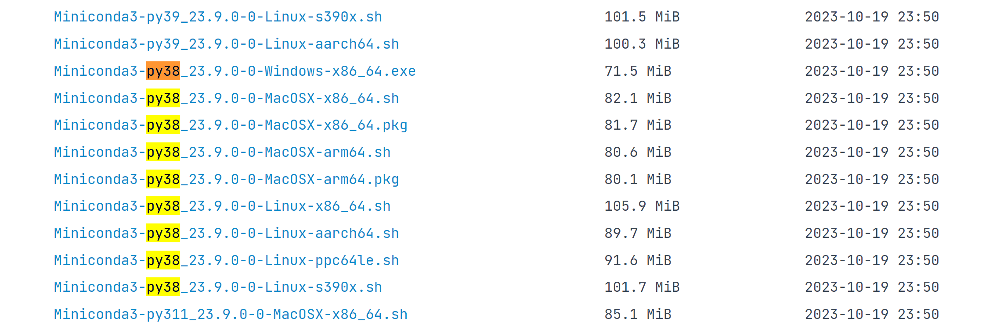
    <p>指定 Python 版本的安装包列表</p> 
</div>

在服务器端，可通过 `wget` 命令下载安装包。下载完成后，需要给安装包赋予执行权限方可开始安装。

```bash
// 赋予执行权限
chmod +x Miniconda3-py38_23.9.0-0-Linux-x86_64.sh

开始安装
./Miniconda3-py38_23.9.0-0-Linux-x86_64.sh
```

执行上述命令之后将会弹出用户协议，跳转到协议末尾输入 `yes` 即可开始安装，安装结束后会提示是否将 Conda 环境变量添加到当前 bash 的配置，请输入 `yes`。

重启当前 bash 或执行以下命令更新当前 bash 的环境变量，bash 命令提示符变形如 `(base) user@remote` 则说明 Conda 安装完成。

```bash
source ~/.bashrc
```
或使用以下命令查阅 Conda 版本，如果输出内容与下列内容类似，则表示配置正确，可继续后面的步骤。

```bash
conda --version

# 输出：
# conda 23.5.2
```

### 2.2. 镜像源配置

通常情况下，虽然国内镜像源下载速度快，但国内镜像源相较于 Conda 官方镜像源可能存在包缺失、同步不及时等问题，因此在非必要的情况下不建议将官方镜像源替换为国内镜像源。

镜像源详细设置方法参见[北京外国语大学开源软件镜像站 Anaconda 镜像使用帮助](https://mirrors.bfsu.edu.cn/help/anaconda/)，此处不再赘述。

### 2.3. 开始使用

| 常用命令                                 | 说明                                                     |
| ---------------------------------------- | -------------------------------------------------------- |
| `conda info --envs`                      | 查看已创建的环境                                         |
| `conda create -n my_env`                 | 创建名为 `my_env` 的环境                                 |
| `conda remove -n my_env --all`           | 删除名为 `my_env` 的环境                                 |
| `conda activate my_env`                  | 将名为 `my_env` 的环境设置为工作环境（仅对当前终端有效） |
| `conda install <PACKAGE_NAME>`           | 在工作环境中安装依赖包，自动索引适配当前环境的最新版本   |
| `conda install <PACKAGE_NAME>=<VERSION>` | 在工作环境中安装依赖包的指定版本                         |
| `conda config --remove-key channels`     | 恢复默认镜像源                                           |

### 2.4. 安装常用包（Package）

#### 2.4.1. PyTorch

由于 PyTorch 包只在官方渠道分发，因此安装时需要指定 Conda Channel 为 PyTorch，简单起见可直接访问 [PyTorch 官网](https://pytorch.org/get-started/locally/) 通过图形界面获得对应的 Conda 安装命令，如下所示。

<div align='center'>
    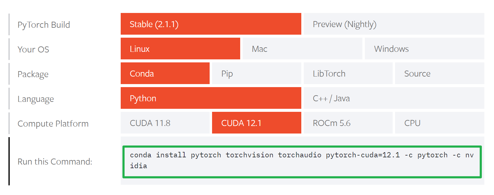  
    <p>根据实际情况获取 PyTorch 安装命令</p>
</div>

获得安装命令后，在本地创建好的 Conda 环境中执行即可。

#### 2.4.2. 其他包

其他包如 Numpy、Pandas 等，可直接通过 `conda install <PACKAGE_NAME>` 的形式尝试安装，或通过 [Anaconda 搜索页面](https://anaconda.org/search) 检索对应的包安装命令，然后在本地对应的 Conda 环境中执行安装命令即可开始安装。

#### 2.4.3. 特殊情况

##### 2.4.3.1. 缺失包
若 Anaconda 中缺失某些特定包 Conda 无法安装时，可尝试使用 Python 包管理器安装。确保在本地 Conda 环境中安装好 Python 后，使用 Python 自带的包管理工具 pip 安装包，命令通常形如 `pip install <PACKAGE_NAME>`。

可通过 pip 安装的依赖包可见 [Python Package Index](https://pypi.org/)，在页面中直接搜索包名即可找到对应的安装命令。

##### 2.4.3.2. 指定版本

对于 Conda，在安装命令中将包名替换为形如 `<PACKAGE_NAME>=<VERSION>` 的形式，即可指定版本，示例如下。

```shell
conda install numpy=1.26.0 
```

对于 pip，仅需将上述命令中的单个 `=` 替换为 `==` 即可，示例如下。

```shell
pip install numpy==1.26.0
```

## 3. Visual Studio Code 开发环境

VS Code 官方提供了远程开发说明文档，请参照官方说明进行下述操作，文档地址：[Remote Development using SSH](https://code.visualstudio.com/docs/remote/ssh)。

### 3.1. 连接服务器

VS Code 通过 SSH 的方式连接远程服务器，因此首先需要在 VS Code 中添加服务器 SSH 配置。添加 SSH 配置有两种方法：

1. 通过 `Ctrl+Shift+P` 打开命令面板，输入 SSH 关键字，选择 Add New SSH Host；  
2. 单击左侧活动栏中 SSH 远程资源管理器中的“新增”图标，如下图红框所示。

<div align='center'>
    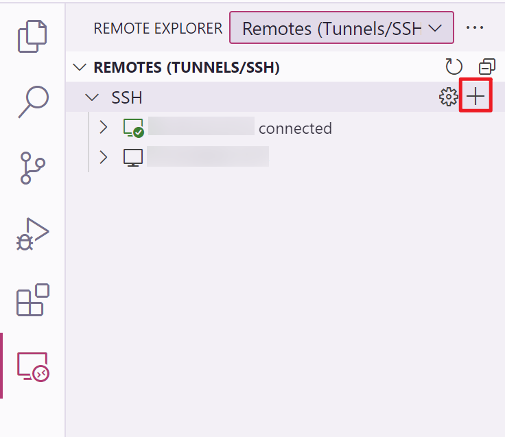  
    <p>VS Code 添加 SSH 配置</p>
</div>

在弹出的输入框中填入形如 `ssh username@remotehost:port` 的命令，其中 `username` 表示服务器中的用户名，`remotehost` 表示服务器地址，`port` 表示 SSH 端口，通常为 22（可缺省），界面如下图所示。

<div align='center'>
    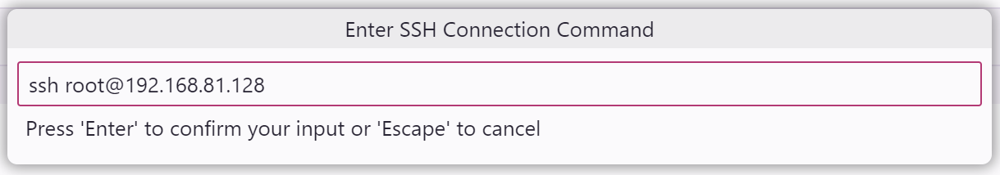
    <p>输入 SSH 连接命令</p>  
    
</div>

添加完成后，单击左侧活动栏中 SSH 远程资源管理器中的“刷新”图标，即可找到最新添加的 SSH 配置。

<div align='center'>
    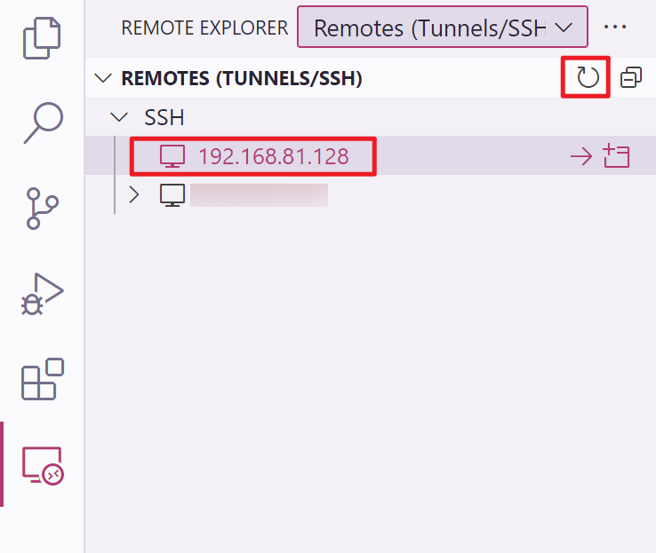
    <p>刷新 SSH 配置</p>  
</div>

点击上图右侧箭头即可连接到服务器，连接时请输入对应用户的密码。

<div align='center'>
    
    <p>输入 SSH 密码</p>  
</div>

连接完成后，VS Code 主界面左下角将展示当前窗口的服务器地址及连接方式。

<div align='center'>
    
    <p>当前已连接的服务器</p>  
</div>

在开始开发之前，需要通过菜单栏 File - Open Folder 打开项目所在目录。选中需要打开的目录，点击窗体右上角的 OK 按钮即可。

<div align='center'>
    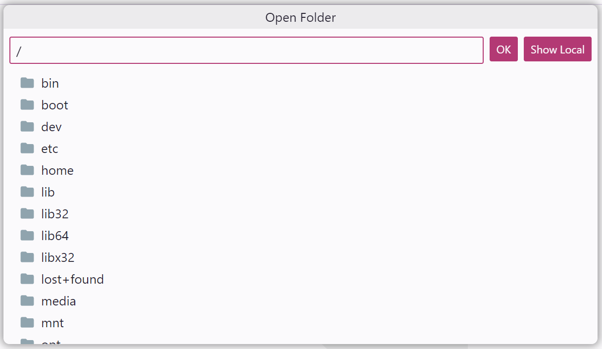
    <p>打开服务器文件夹</p>  
</div>

### 3.2. 设置 Python 解释器

单击 VS Code 左侧活动栏中的“扩展”图标，搜索 `Python` 关键词，选择下图所示的扩展，点击安装到服务器即可。

<div align='center'>
    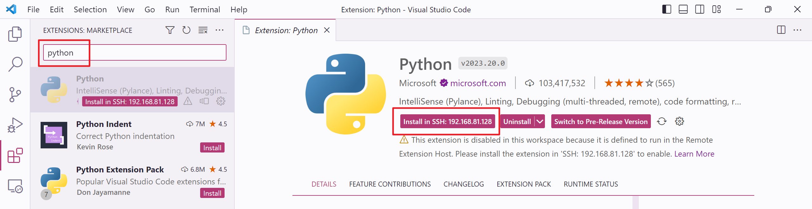
    <p>在服务器中安装 Python 扩展</p> 
</div>

安装完成后通过任务命令面板（`Ctrl+Shift+P`）选择 Reload Window 重新加载当前窗口。重新加载完成后，VS Code 窗口右下角会提示正在为服务器安装 VS Code Server。

<div align='center'>
    
    <p>自动为服务器安装 VS Code Server</p>  
</div>

在当前窗口打开任意 `.py` 源代码文件，即可在当前 VS Code 窗口右下角找到“选择解释器”按钮，单击该按钮选择需要的解释器即可。

<div align='center'>
    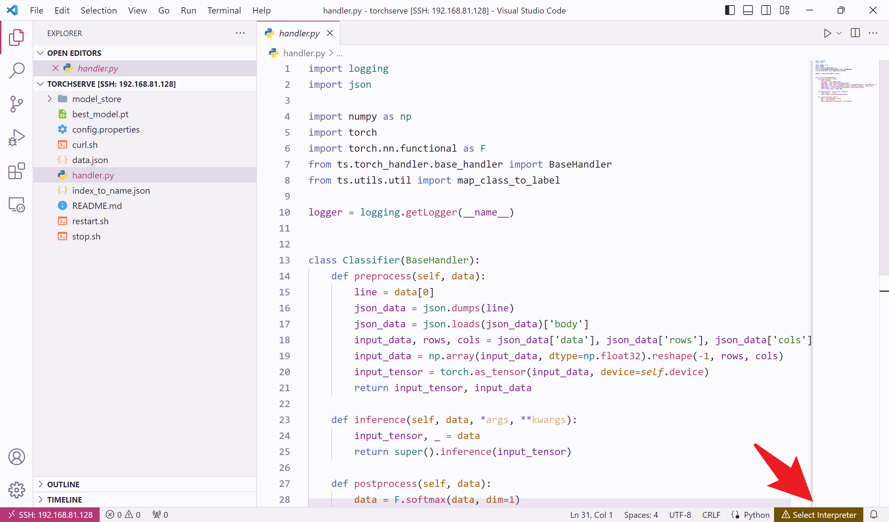
    <p>选择 Python 解释器按钮</p> 
</div>

<div align='center'>
    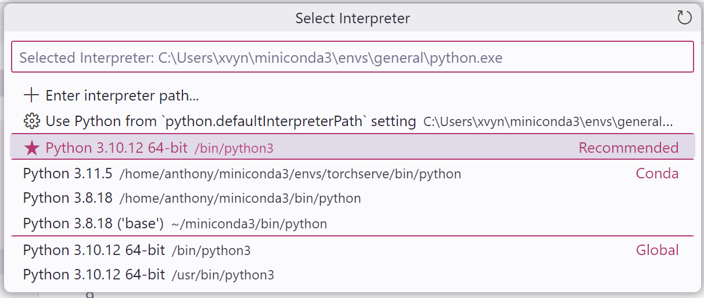
    <p>选择项目需要的解释器环境</p>  
</div>

选择完成后，VS Code 窗口右下角将会实时展示当前的解释器环境。至此 VS Code 远程开发环境配置完成。

<div align='center'>
    
    <p>已为当前项目选定的解释器环境</p>  
</div>

## 4. PyTorch 代码框架

船舶行为识别项目结构如下：
```text
vbr
│  requirements.txt             项目依赖的库及其版本
├─data
│  ├─processed
│  │   │  *.csv                 处理后的数据文件
│  │   │  data.json             数据文件与行为类别的对应关系
│  │   │  label_classes.txt     行为类别
│  │   └─ permutation.txt       数据读取顺序
│  └─raw
|      │  ai_trace_data.csv     原始数据
│      └─ *.csv                 按目标拆分后的原始数据
├─saved                         用于保存训练好的模型及相关日志文件
└─src
    │  inference.py             推理
    │  process_data.py          数据处理
    │  test.py                  测试模型
    │  train.py                 训练模型
    ├─config
    │  └─ config.py             参数配置文件
    ├─dataloader
    │  │  custom_dataset.py     自定义数据集
    │  └─ dataloader.py         数据读取
    ├─model
    │  │  base_model.py         模型基类
    │  │  model.py              构建模型、训练与验证模型
    │  └─ network.py            网络结构
    └─utils
       │  config.py             读取配置
       └─ util.py               工具类
```

基于 PyTorch 开发的深度学习应用通常主要包括以下模块：

1. 数据预处理模块；  
2. 数据加载模型；  
3. 网络与模型构建模块；  
4. 模型训练与验证模块；  
5. 模型测试模块。  

下面将按照上述顺序分别介绍各个模块。

### 4.1. 数据预处理

原始数据包含 14 列，列名及对应含义如下表。

| 列名           | 含义                                                        | 示例                    |
| -------------- | ----------------------------------------------------------- | ----------------------- |
| ts             | 时间                                                        | 2022-08-22 23:58:54.312 |
| longitude      | 经度                                                        | 114.251485685614        |
| latitude       | 纬度                                                        | 22.568623333333296      |
| tgtheight      | 目标高度（米）                                              | 0.0                     |
| course         | 目标航向（度）                                              | 253.6000061             |
| speed          | 目标航速（节）                                              | 0                       |
| fusiontype     | 融合目标类型，1=单雷达，2=单 AIS，11=AIS+雷达，13=雷达+雷达 | 2                       |
| srcmmsi        | AIS 子源 MMSI，若无 AIS 子源则为 0                          | 412467370               |
| isconnecting   | 是否接驳，0=未接驳，1=接驳                                  | 0                       |
| connecttgttype | 接驳目标类型，1=单雷达，2=单 AIS，11=AIS+雷达，13=雷达+雷达 | 0                       |
| withinborder   | 边境属性，0=内地海域，1=香港海域                            | 0                       |
| starttime      | 融合时间，UTC 时间毫秒数                                    | 2022-08-22 23:58:54.312 |
| batchnum       | 目标唯一 ID                                                 | 220822999000804         |
| tracetype      | 行为类别，0=正常，1=异常                                    | 0                       |

由于 TDEngine 导出数据后生成的单个 CSV 体积较大，不利于 Python 读取及后续处理，因此需要先将数据按照 `batchnum` 即目标唯一 ID 拆分。

#### 4.1.1. 数据拆分

> 详见深度学习项目源代码 `vbr/src/process_data.py` 中 `split_data()`

本项目使用 [Pandas](https://pandas.pydata.org/) 读取 CSV 文件，同时使用 `groupby` 操作对数据分组，并将同一组的数据保存到单个 CSV 文件中，文件名为 `batchnum`。相关代码如下：

```python
for raw_data_dir in raw_data_dir_list:  # 依次读取 Config.py 中设置的数据源文件

    # Load data and group by batchnum
    data = pd.read_csv(os.path.join(root_dir, raw_data_dir))
    i, row_count = 0, data['batchnum'].unique().shape[0]

    for batch_id, group in data.groupby('batchnum'):
        # Get same batch id data and save them to a single csv file
        group.to_csv(os.path.join(root_dir, config.data.raw_folder, f'{batch_id}.csv'), index=False)
        i += 1
```

#### 4.1.2. 列选取与归一化

> 详见深度学习项目源代码 `vbr/src/process_data.py` 中 `preprocess()`

完成数据拆分后，还需要剔除不需要的列，并对数据进行归一化处理。需要保留的列为：ts（时间）、longitude（经度）、latitude（纬度）、course（目标航向）、speed（目标航速）、fusiontype（融合目标类型）。

丢弃不需要的列：

```python
# Load data
df = pd.read_csv(os.path.join(root_dir, 'data', 'raw', file))

# Labels and classes
labels[file] = int(df['tracetype'][0])
classes.add(df['tracetype'][0])

# Drop useless columns
df.drop(labels=['tgtheight', 'course', 'srcmmsi', 'isconnecting',
                'connecttgttype', 'starttime', 'batchnum', 'tracetype'],
        axis=1, inplace=True)
```

在数据处理过程中，应该同时保存数据文件及其行为类型的对应关系。在项目中采用字典数据结构实现，key 设置为数据文件名，value 则为该数据对应的行为类型，最终将其保存到 `vbr/data/processed/data.json` 文件中。数据片段如下所示：

```json
{
  "220822999000804.csv": 0,
  "220822999000805.csv": 1,
  "220822999000806.csv": 0,
  "220822999000811.csv": 0,
  "220822999000812.csv": 0,
  // ...
}
```

对于保留下来的列数据，每一列的值域不尽相同，不利于深度学习模型收敛，因此归一化至关重要。下表是各个列的原始值域和转换后值域的范围：

| 列           | 原始值域           | 归一化后值域                         | 备注                                                          |
| ------------ | ------------------ | ------------------------------------ | ------------------------------------------------------------- |
| day          | -                  | $[\frac{1}{366}, 1.0]$               | 由 ts 列拆分得到，表示当前日期与当年总天数的比值              |
| time         | -                  | $[0, 1]$                             | 由 ts 列拆分得到，表示当前时间与 24 小时总秒数的比值          |
| longitude    | $[-180°, 180°]$    | $[-1, 1]$                            | 表示经度与 180° 的比值，负值表示西经，正值表示东经            |
| latitude     | $[-90°, 90°]$      | $[-1, 1]$                            | 表示纬度与 90° 的比值，负值表示南纬，正值表示北纬             |
| speed        | $[0, 80]$          | $[0, 1]$                             | 表示航速与 80 节的比值                                        |
| fusiontype   | $\{1, 2, 11, 13\}$ | $\{0, \frac{1}{3}, \frac{2}{3}, 1\}$ | 由融合类别重新映射到 $\{0, 1, 2, 3\}$，按照顺序对应，并求比值 |
| withinborder | $\{0, 1\}$         | $\{0, 1\}$                           | 所处海域类型，无需特殊处理                                    |

数据处理代码片段：

```python
df_time = pd.to_datetime(df['ts'])                  # 将 ts 列转换为日期时间类型值
df.insert(0, 'day', df_time.dt.dayofyear / 366.)    # 将日期比例单独作为一列插入到列表中
df['ts'] = ((df_time.dt.hour * 60 + df_time.dt.minute) * 60 + df_time.dt.second) / 86400.
df.rename(columns={'ts': 'time'})                   # 计算秒比例后，将 ts 列重命名为 time

# Normalize other variables
df['longitude'] = df['longitude'] / 180.    # West to East (-180° to 180°)
df['latitude'] = df['latitude'] / 90.       # South to North (-90° to 90°)
df['speed'] = df['speed'] / 80.             # Knots (0 to 80)
df['fusiontype'] = df['fusiontype'].map({1: 0, 2: 1, 11: 2, 13: 3}) / 3.
```

### 4.2. 数据集

#### 4.2.1. 数据集加载及划分

> 详见深度学习项目源代码 `vbr/src/dataloader/dataloader.py` 中 `load_data()`

首先读取上述步骤中保存的 `data.json` 文件，变量 `files` 为字典的 keys，`labels` 为字典的 values。

```python
def load_data(self, is_test: bool = False):
    with open(os.path.join(self.config.root_dir, self.config.data.proc_folder, 'data.json'), 'r') as f:
        data = json.load(f)
    files, labels = np.array(list(data.keys())), np.array(list(data.values()))
```
> 详见深度学习项目源代码 `vbr/src/dataloader/dataloader.py` 中 `train_val_test_split()`

然后将上述 `files` 与 `labels` 按照相同的顺序打乱（仅在 `shuffle=True` 时打乱顺序，默认打乱），并划分为训练集、验证集与测试集。最后返回字典，字典格式如下：

```python
'train': {                      # 训练集
    'files': [                  # 训练集输入文件数组
        220822999012314.csv,    
        220822999000805.csv,
        ...
    ],
    'labels': [0, 0, ...]       # 训练集输入文件对应的船舶行为类别
},
'val': {                        # 验证集
    'files': [...],             # 格式同训练集
    'labels': [...]             # 格式同训练集
},
'test': {                       # 测试集
    'files': [...],             # 格式同训练集
    'labels': [...]             # 格式同训练集
}
```

#### 4.2.2. 重写 Dataset

深度学习项目通常使用 PyTorch 的 Dataset 模块实现数据集整合。由于 `torch.utils.data.Dataset` 是表示数据集的抽象类，自定义数据集应继承 Dataset 并重写以下方法：

- `__len__`，使得 `len(dataset)` 可以返回数据集的大小；  
- `__getitem__`，使得 `dataset[i]` 可用于获取第 $i$ 个样本。

以下代码创建了 `CustomDataset` 类，重写了上述方法。值得注意的是，训练集验证集与测试集都需要分别调用本类以获得对应的数据集，因此 `data` 即为上述字典中对应的值，包含 `files` 和 `labels` 两个子数组。

在 `__getitem__` 方法中，通过 `np.loadtxt()` 将指定 `index` 的本地输入文件读取为 `numpy.ndarray`，读取时需指定 CSV 文件分隔符以及数据类型，在本例中将数据类型指定为单精度浮点数 `np.float32`。后通过 `torch.from_numpy()` 将输入数据转换为 `torch.tensor`。

而 `labels[index]` 得到的 `label` 为整形数据，因此可以直接使用 `torch.tensor()` 将其转换为 `torch.tensor`。

```python
class CustomDataset(Dataset):
    def __init__(self, config, data):
        self.config = config
        self.files = data['files']
        self.labels = data['labels']

    def __len__(self):
        return len(self.files)

    def __getitem__(self, index):
        input_data = torch.from_numpy(np.loadtxt(os.path.join(self.config.root_dir,
                                                              self.config.data.proc_folder,
                                                              self.files[index]),
                                                 delimiter=',', dtype=np.float32))
        label = torch.tensor(self.labels[index], dtype=torch.long)
        return input_data, label
```

### 4.3. 参数配置

由于深度学习项目涉及的参数较多，为方便开展多种实验避免在代码中写死配置参数，通常通过配置文件或其他方式灵活配置。在本项目中，参数配置文件为 `vbr/src/config/config.py`，内容以 JSON 形式组织，共分为三部分，如下所示：

```python
CFG = {
    "data": {                                   # 数据相关参数
        "raw_data_list": [                      # 原始数据文件路径列表
            "data/data_231121.csv",             # 原始数据文件一
            "data/abnormal_data_aug.csv"        # 原始数据文件二
        ],
        "raw_folder": "data/raw/",              # 拆分后的原始数据文件存放目录
        "proc_folder": "data/processed/",       # 经过预处理后的数据文件存放目录
    },
    "train": {                                  # 模型训练相关参数
        "seed": 42,                             # Numpy、PyTorch 及 CUDA 等组件的随机种子
        "train_batch_size": 256,                # 训练集每批次包含的样本数
        "val_batch_size": 2048,                 # 验证集与测试集每批次包含的样本数
        "epoch": 200,                           # 训练总轮数
        "train_portion": 0.7,                   # 训练集占全部样本的比例
        "val_portion": 0.2,                     # 验证集占全部样本的比例（测试集比例 = 1 - 训练集 - 验证集）
        "lr": 2e-5,                             # 模型学习率
        "gamma": 0.985,                         # 学习率指数衰减因子
        "loss_weight": [                        # 损失函数权重因子
            1.0,                                # 类别 0 的损失权重
            5.0                                 # 类别 1 的损失权重
        ]
    },
    "model": {                                  # 模型定义相关参数
        "input_size": 7,                        # LSTM 模型输入数据的列大小
        "hidden_size": 256,                     # LSTM 隐藏层大小
        "num_layers": 3,                        # LSTM 堆叠数量
        "dropout": 0.25,                        # 随机丢弃率
        "n_classes": 2,                         # 行为类别数量
    }
}
```

配置好参数文件后，通过 `vbr/src/utils/config.py` 读取上述配置文件，同时将其转换为 Python 字典以便于其他模块使用。

### 4.4. 网络结构与模型构建

#### 4.4.1. 网络结构

> 详见深度学习项目源代码 `vbr/src/model/network.py`

目前项目中的网络结构定义较为简单，仅用于跑通整个流程。PyTorch 自定义模型时，必须继承自 `torch.nn.Module`，同时复写 `forward()` 方法。

网络结构定义如下所示，在构造方法中初始化了 LSTM 网络 `self.lstm`、全连接网络分类器 `self.classifier` 及一个激活函数 `self.sigmoid`。

对于 `forward()` 方法，首先将输入数据 `x` 输入到 `self.lstm`，并将其最后一个输出作为 LSTM 网络的输出，然后将其输入到全连接网络分类器 `self.classifier` 得到输出，最后将使用激活函数 `self.sigmoid` 处理后的输出作为整个模型的预测结果返回。

```python
class Network(nn.Module):
    def __init__(self, config):
        super().__init__()
        self.lstm = nn.LSTM(
            input_size=config.model.input_size,     # 输入数据列大小
            hidden_size=config.model.hidden_size,   # LSTM 模型隐藏层大小
            num_layers=config.model.num_layers,     # LSTM 模型堆叠数量
            dropout=config.model.dropout,           # 随机丢弃率
            batch_first=True        # 数据 Shape 以批次优先，即 (batch_size, seq_len, input_size)
        )
        self.classifier = nn.Linear(config.model.hidden_size, config.model.n_classes)
        self.sigmoid = nn.Sigmoid()

    def forward(self, x: torch.Tensor) -> torch.Tensor:
        self.lstm.flatten_parameters()      # 重置 LSTM 参数，仅在 CUDA 端生效
        _, (hidden, _) = self.lstm(x)       # 将数据输入到 LSTM 网络中
        out = hidden[-1]                    # 取最后一层的输出
        out = self.classifier(out)          # 将上述输出送入分类器
        out = self.sigmoid(out)             # 将分类器输出送入激活函数
        return out                          # 将激活函数输出作为整个模型的预测结果并返回
```

#### 4.4.2. 模型构建

> 详见深度学习项目源代码 `vbr/src/model/model.py`

在完成网络结构定义后，实例化网络结构类即可完成模型构建，如下所示：

```python
def build(self) -> None:
    self.model = Network(self.config)   # 获取网络实例
    self.model.to(self.device)          # 将其传递到训练设备上（CPU 或 CUDA）
```

### 4.5. 训练与验证

> 详见深度学习项目源代码 `vbr/src/model/model.py` 中 `train()`

#### 4.5.1. 初始化

在模型训练开始之前，需要做一系列初始化工作。

##### 4.5.1.1. 数据加载

通过 `DataLoader` 类中的 `load_data()` 获取训练与测试数据集。

```python
def load_data(self) -> None:
    data = DataLoader(self.config).load_data()                      # data 为字典类型
    self.train_data, self.val_data = data['train'], data['val']     # 根据 key 取得对应的数据集
```

##### 4.5.1.2. 设置优化器与学习率调节器

```python
# Adam 优化器
optimizer = torch.optim.Adam(params=self.model.parameters(), lr=self.config.train.lr)
# 学习率按指数衰减，下一轮训练时的学习率为上一轮的 gamma 倍
scheduler = torch.optim.lr_scheduler.ExponentialLR(optimizer=optimizer, gamma=self.config.train.gamma)
```

##### 4.5.1.3. 设置损失函数

```python
# 分类任务常用的交叉熵损失
self.criterion = nn.CrossEntropyLoss(   
    # 按照 Config.py 中的设置，为不同类别赋予不同的权重
    weight=torch.FloatTensor(self.config.train.loss_weight).to(self.device),
    reduction='mean'  # 返回一个批次的损失平均值
)  
```

##### 4.5.1.4. 获取训练集 DataLoader

```python
train_dataloader = torch.utils.data.DataLoader(
    CustomDataset(self.config, self.train_data),
    batch_size=self.config.train.batch_size,
    shuffle=True,
    num_workers=4,      # 数据加载 worker 数量
    pin_memory=True     # 常驻内存避免频繁 IO
)
```

##### 4.5.1.5. 获取验证集 DataLoader

```python
val_dataloader = torch.utils.data.DataLoader(
    CustomDataset(config=self.config, data=self.val_data),
    batch_size=self.config.train.val_batch_size,
    shuffle=True,
    num_workers=4,      # 同训练集
    pin_memory=True
)
```

#### 4.5.2. 训练

```python
for epoch in range(self.config.train.epoch):
    train_loss_sum = 0.                                             # 用于计算一整轮的训练损失
    self.model.train()                                              # 将模型置于训练模式
    for batch_index, batch in enumerate(train_dataloader):          # 遍历 DataLoader 获取每批次的数据
        x, y = batch[0].to(self.device), batch[1].to(self.device)   # 将数据解包为输入数据与对应的标签
        optimizer.zero_grad()                                       # 每批次都需要将梯度重置为 0
        output = self.model(x)                                      # 得到当前批次的预测结果
        loss = self.criterion(output, y)                            # 根据模型预测结果与真实标签，计算预测损失
        loss.backward()                                             # 计算梯度
        optimizer.step()                                            # 根据梯度更新所有张量（tensor）
        train_loss_sum += loss.item()                               # 累加每一个 epoch 的训练损失
        prediction = torch.argmax(output, dim=1)                    # 得到当前批次的预测类别
        acc = (prediction == y).float().mean()                      # 计算训练集当前批次的分类准确率
```

#### 4.5.3. 验证

```python
self.model.eval()           # 将模型置于预测模式，自动禁用随机丢弃等机制
with torch.no_grad():       # 禁用梯度计算
    for _, batch in enumerate(val_dataloader):                      # 遍历 DataLoader 获取每批次的数据
        x, y = batch[0].to(self.device), batch[1].to(self.device)   # 将数据解包为输入数据与对应的标签
        output = self.model(x)                                      # 得到当前批次的预测结果
        loss = self.criterion(output, y)                            # 根据模型预测结果与真实标签，计算预测损失
        val_loss += loss.item()                                     # 保存当前批次验证损失
        prediction = torch.argmax(output, dim=1)                    # 得到预测的类别
        accuracy += (prediction == y).sum().item()                  # 计算验证集分类准确率
```

#### 4.5.4. 保存损失值与模型

> 详见深度学习项目源代码 `vbr/src/model/model.py` 中 `log_loss()` 与 `save_model()`

当模型在当前批次的验证集的精度为历史最高验证集精度时，就需要将当前批次的模型保存下来作为最优模型，并更新最高验证集精度值。

```python
# 保存每一个 epoch 训练集与验证集的损失值
self.log_loss(epoch)

# 保存达到最高验证精度时的模型
if highest_acc < val_acc_mean:
    highest_acc = val_acc_mean
    self.save_model(self.model)
```

保存模型时，不仅需要保存完整模型参数到 `pth` 文件，还需要保存 Torch Script 模型到 `pt` 文件，方便 Torch Serve 模型部署工作，避免重复对模型进行加载另存等操作。同时，还需要保存当前批次的训练损失与验证损失，为更加直观地观察训练效果，还需要将两者损失可视化为曲线图。

```python
def save_model(self, model: torch.nn.Module) -> None:
    model_path = os.path.join(self.save_to, 'best_model.pth')       # 完整模型保存路径
    jit_model_path = os.path.join(self.save_to, 'best_model.pt')    # Torch Script 模型保存路径
    torch.save(model, model_path)                                   # 保存完整模型，以便后续继续训练

    script_model = Network(self.config)                             # 生成 Torch Script 模型
    script_model.load_state_dict(model.state_dict())                # Torch Script 模型加载 PyTorch 模型参数
    for parameter in script_model.parameters():
        parameter.requires_grad = False
    script_model.eval()
    traced_model = torch.jit.trace(script_model,
                                   torch.rand(1, 1, self.config.model.input_size))
    traced_model.save(jit_model_path)                               # 保存 Torch Script 模型以便开展模型部署工作
```

训练过程中的模型训练与验证损失曲线示例图像如下。

<div align='center'>
    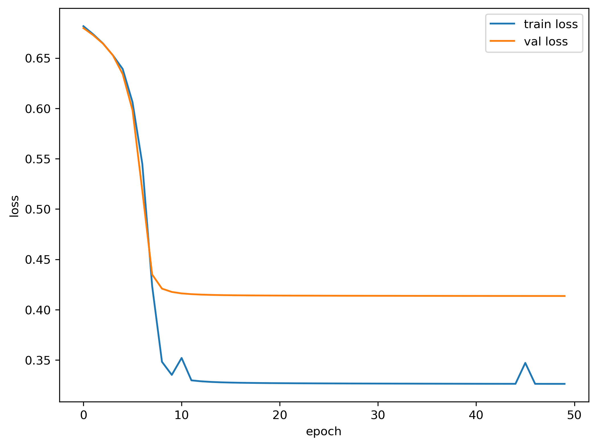
    <p>训练与验证损失曲线示例</p>  
</div>

### 4.6. 测试

> 详见深度学习项目源代码 `vbr/src/test.py`

#### 4.6.1. 加载模型

在开始测试之前，需要先加载上述保存的模型文件。

```python
model = torch.load(os.path.join(folder, 'best_model.pth'))
model.to(device)
```

#### 4.6.2. 加载数据

模型加载之后，通过 `DataLoader` 类中的 `load_data()` 获取测试数据集，并创建测试集 DataLoader。

```python
data_loader = DataLoader(config)
test_data = data_loader.load_data()['test']         # 获取测试数据集
test_dataloader = torch.utils.data.DataLoader(      # 生成测试集 DataLoader
    CustomDataset(config=config, data=test_data), 
    batch_size=config.train.val_batch_size,         # 参数同验证集
    num_workers=4,
    pin_memory=True
)
```

#### 4.6.3. 预测并保存结果

与验证集逻辑类似，测试模型时也将禁用反向传播，只保留模型的预测结果，同时不计算预测损失。

```python
model.eval()                    # 将模型置于预测模式，自动禁用随机丢弃等机制   
y_true, y_pred = [], []         # 保存数据真实类别与预测类别
with torch.no_grad():           # 禁用梯度计算
    for _, batch in enumerate(test_dataloader):                 # 遍历 DataLoader 获取每批次的数据
        x, y = batch[0].to(device), batch[1].to(device)         # 将数据解包为输入数据与对应的标签
        y_true += y.tolist()                                    # 保存真实标签
        output = model(x)                                       # 得到当前批次的预测结果
        y_pred += torch.argmax(output, dim=1).tolist()          # 得到预测类别并记录下来

with open(os.path.join(folder, 'test_result.txt'), 'w') as f:
    f.writelines('\n'.join(str(line) for line in y_pred))       # 将预测类别保存到文本文件中
```

#### 4.6.4. 结果可视化

针对分类预测结果，可采用混淆矩阵对其可视化，同时采用准确率、精确率、召回率和 F1 分数对结果进行量化。关于这些概念和指标的详细介绍，可以参见博客文章[混淆矩阵、准确率、精确率/查准率、召回率/查全率、F1值、ROC曲线的AUC值](https://www.cnblogs.com/wuliytTaotao/p/9285227.html)。

##### 4.6.4.1. 混淆矩阵

混淆矩阵常用于分类任务的结果可视化，混淆矩阵示意图如下图所示。

<div align='center'>
    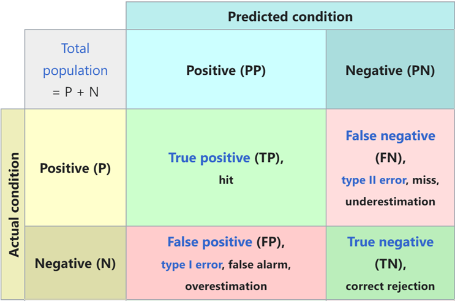
    <p>混淆矩阵定义</p>  
</div>

其中 TP、FP、FN、TN 的具体含义如下表所示。

| 缩写 | 含义                                                             |
| ---- | ---------------------------------------------------------------- |
| TP   | 真实类别为 Positive，模型预测的类别也为 Positive                 |
| FP   | 预测为 Positive，但真实类别为 Negative，真实类别和预测类别不一致 |
| FN   | 预测为 Negative，但真实类别为 Positive，真实类别和预测类别不一致 |
| TN   | 真实类别为 Negative，模型预测的类别也为 Negative                 |

即 TP、FP、TN、FN 第二个字母表示样本被预测的类别，第一个字母表示样本的预测类别与真实类别是否一致。

真实混淆矩阵示意图如下所示。

<div align='center'>
    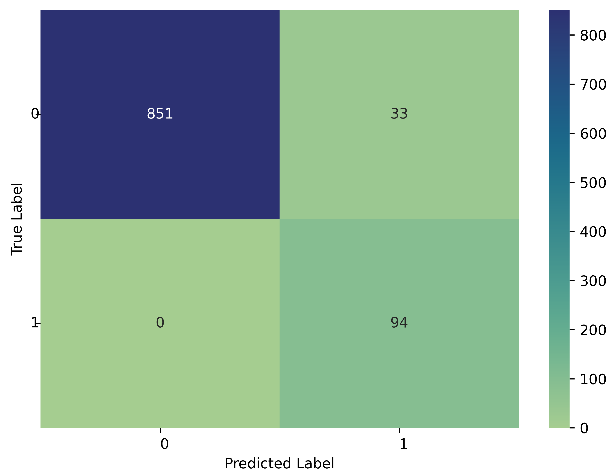
    <p>混淆矩阵示例图像</p>  
</div>

首先使用 `sklearn.metrics` 通过真实标签与预测标签计算得到混淆矩阵，再使用 `util.py` 中的 `plot_matrix()` 绘制混淆矩阵图像，并将其保存到对应目录中。

```python
classes = data_loader.label_classes()
matrix = metrics.confusion_matrix(y_true, y_pred, labels=classes.argsort())

np.savetxt(os.path.join(folder, 'confusion_matrix.txt'), matrix, fmt='%d', delimiter=',')
plot_matrix(matrix, classes, x_label='Predicted Label', y_label='True Label',
            save_to=os.path.join(folder, 'confusion_matrix.png'), ticks_rotation=0, show=False)
```

##### 4.6.4.2. 五大指标

准确率（Accuracy）是二元分类中常用的结果评估参数，其值代表样本类别预测正确的数量与总样本量的比值，数值越接近 1 说明模型预测效果越精准。准确率数学表达式如下。

$$ Accuracy = \frac{TP +TN}{TP + TN + FP + FN} = \frac{TP + TN}{\text{all data}} $$

精确率（Precision）是指在预测为 Positive 的样本中，真实类别为 Positive 的样本所占的比例，数值越大越好。精确率数学表达式如下。

$$ Precision = \frac{TP}{TP + FP} = \frac{TP}{\text{被预测为 Positive 的样本}} $$

召回率（Recall）是指在全部 Positive 样本中，模型预测为 Positive 的样本所占的比例，数值越大越好。召回率数学表达式如下。

$$ Recall = \frac{TP}{TP + FN} = \frac{TP}{\text{真实为 Positive 的样本}} $$

F1 分数（F1 score）是分类模型的性能评价指标，它是精确率（Precision）和召回率（Recall）的调和平均值。F1 分数在某些情况下可以更全面地反映模型的性能，特别是当正负样本分布不均衡时，数值越大越好。F1 分数表达式如下。

$$ F_1 = \frac{2}{\frac{1}{Precision} + \frac{1}{Recall}} = \frac{2 \cdot Precision \cdot Recall}{Precision + Recall} = \frac{2TP}{2TP + FP + FN}$$

AUC（Area Under the ROC Curve）是 “ROC 曲线下的面积”。也就是说，AUC 指（0,0）到（1,1）的 ROC 曲线下方的整个二维区域。ROC（Receiver Operating Characteristic curve）是显示分类模型在所有分类阈值下的性能的图表。此曲线与真阳性率（True Positive Rate，TPR，也称为召回率）及假阳性率（False Positive Rate，FPR，也称为误报率）相关。TPR 与 FPR 的计算公式如下：

$$ TPR = \frac{TP}{TP + FN} \\ FPR = \frac{FP}{FP + TN}$$

ROC 曲线和 AUC 示意图如下。

<div align='center'>
    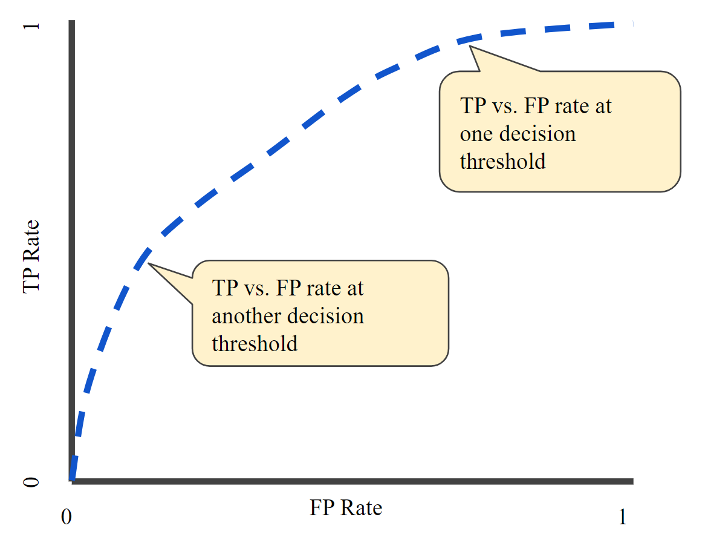
    <p>不同分类阈值下的 TPR 与 FPR</p>  
</div>

<div align='center'>
    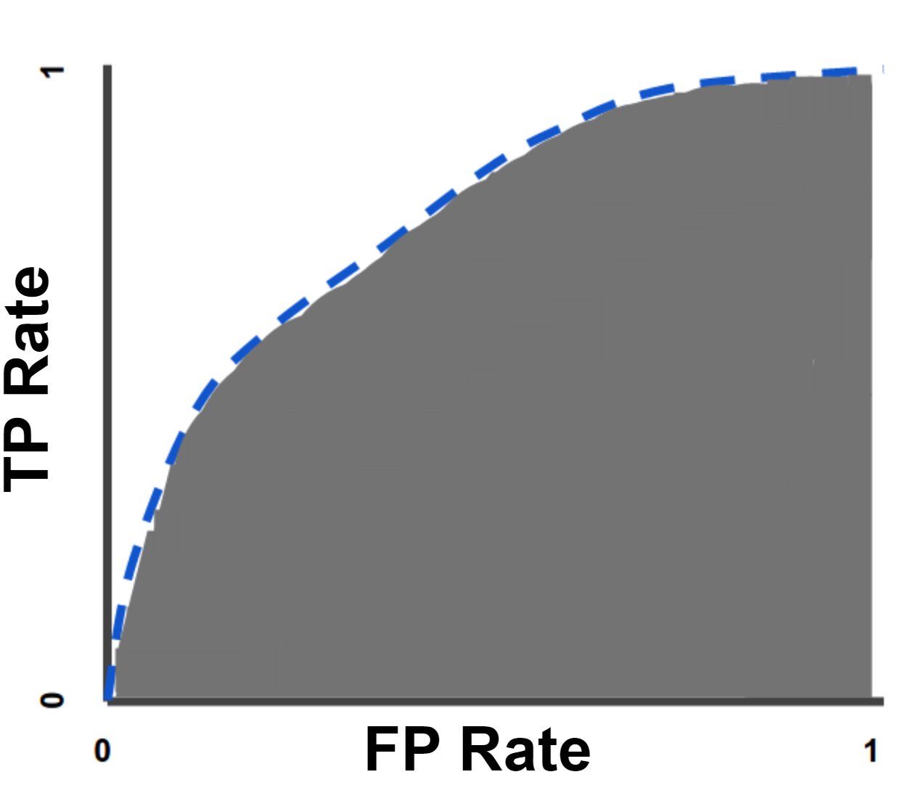
    <p>AUC 示意图（灰色部分）</p> 
</div>

AUC 值域为 $[0, 1]$，预测 100% 错误的模型的 AUC 为 0.0；预测 100% 正确的 AUC 为 1.0。

在本项目中，采用 `sklearn.metrics` 自动计算上述五个指标，并将计算结果保存到文本文件中，相关代码如下。

```python
average = 'macro'
test_metrics = ['accuracy:\t' + str(metrics.accuracy_score(y_true, y_pred)),
                'precision:\t' + str(metrics.precision_score(y_true, y_pred, average=average)),
                'recall: \t' + str(metrics.recall_score(y_true, y_pred, average=average)),
                'f1_score:\t' + str(metrics.f1_score(y_true, y_pred, average=average)),
                'auc:\t\t' + str(metrics.roc_auc_score(y_true, y_pred, average=average))]

with open(os.path.join(folder, 'test_metrics.txt'), 'w') as f:
    f.writelines('\n'.join(test_metrics))
```

保存的文本示例内容如下。

```text
accuracy:	0.9662576687116564
precision:	0.8700787401574803
recall: 	0.9813348416289593
f1_score:	0.9158292800605057
auc:		0.9813348416289593
```

使用 `metrics.roc_curve()` 计算 TPR 和 FPR，同时使用 `util.py` 中的 `plot_roc()` 绘制绘制 ROC 曲线。

```python
fpr, tpr, _ = metrics.roc_curve(y_true, y_pred)
plot_roc(fpr=fpr, tpr=tpr, save_to=os.path.join(folder, 'roc_curve.png'), ticks_rotation=0, show=False)
```

### 4.7. 训练技巧

由于深度学习模型调参技巧纷繁复杂，且没有统一的规律，仅能依靠实验结果反复调整，因此本节并不会详细介绍模型调参技巧。在训练深度学习模型时，一些简单的操作技巧和工具可以大幅提升工作效率，下面简单介绍三个。

#### 4.7.1. 后台训练

在 Linux 服务器中，使用 `nohup` （No hang up，即“不挂断”）命令可以将当前的任务切换到后台执行，同时自动将任务的控制台输出重定向到 `nohup.out` 文件中。需要注意的是，必须要在命令末尾加上 `&` 符号才能使任务在后台运行，使用示例如下。

```shell
nohup python src/train.py &
```

通常情况下，使用 `nohup` 启动后台任务后，控制台会给出后台任务的 `pid`，若想提前终止后台任务，使用 `kill pid` 命令即可实现，用例如下。

```shell
# 假设 nohup 后台程序的 pid 为 987
kill 987
```

若不清楚启动的任务对应的 `pid`，可使用以下命令查询，最大的 `pid` 即为最近启动的 Python 任务。

```shell
ps -ef | grep python
```

#### 4.7.2. 实时输出

由于在训练过程中，需要打印大量日志记录训练信息，Python 对于大量文本输出的情况会使用缓冲区来减少文件 IO，若需要实时展示日志信息或控制台输出，可在执行 Python 脚本时加上 `-u` 参数（即 unbuffered）。结合 `nohup` 的示例命令如下。

```python
nohup python -u src/train.py &
```

请谨慎使用此项，否则可能导致程序频繁 IO，占用大量硬件性能。

#### 4.7.3. 训练状态可视化

在训练模型时，仅仅通过打印日志的方式不能直观地观察到模型性能变化。因此，使用诸如 [Wandb (Weights & Biases)](https://wandb.ai/site) 之类的工具，可以将一些关键指标记录下来实时绘图，还可以在 Web 页面中随时查看。

<div align='center'>
    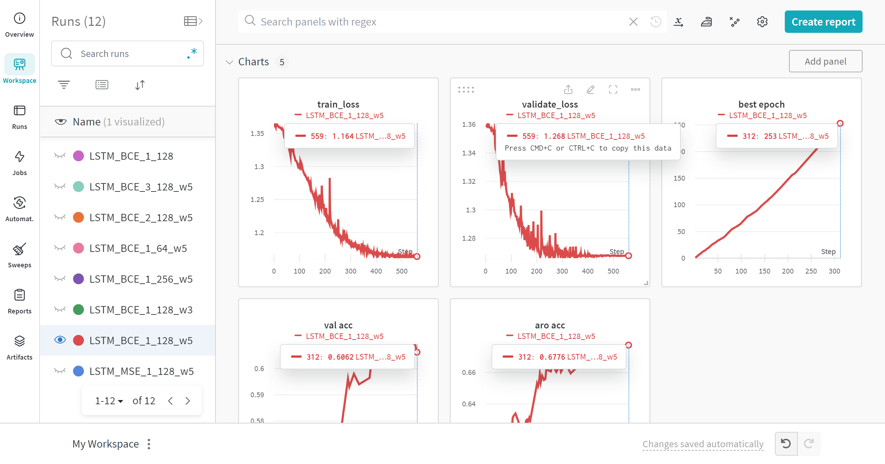
    <p>Wandb 模型训练状态可视化</p> 
</div>

Wandb 的详细使用方法可参考官方文档 [Wandb Quickstart](https://docs.wandb.ai/quickstart)。

## 5. 框架使用方法

深度学习应用开发总体流程图如下所示。

<div align='center'>
    
    <p>深度学习应用开发总体流程</p> 
</div>

### 5.1. 设定训练参数与模型参数

可直接修改 `vbr/src/config/config.py` 中的内容，修改后重新开始训练时生效。`vbr/src/config/config.py` 中的详细配置信息及对应释义见 [4.3. 参数配置](#43-参数配置)。

### 5.2. 训练模型

```shell
conda activate <env>            # 激活 Conda 环境
cd <path_to_vbr_project>        # 切换到项目路径
nohup python src/train.py &     # 开始训练
```

在训练模型时，程序将会自动创建一个名为当前时间的文件夹，形如 `2023-11-23-16-00`，位于项目根目录的 `saved` 目录下。改文件夹主要用于保存模型训练及后续测试过程中产生的所有结果文件，文件列表及释义如下所示。

```text
vbr
└─saved
   └─2023-11-23-16-00               以训练开始时间命名的文件夹
      │  best_model.pt              最佳模型（TorchScript 格式，便于 TorchServe 使用）
      │  best_model.pth             最佳模型（PyTorch 格式）
      │  confusion_matrix.png       混淆矩阵图示
      │  confusion_matrix.txt       混淆矩阵各部分数值，与图示对应
      │  inference.log              模型推理日志，由 inference.py 生成
      │  inference_result.txt       模型推理结果，由 inference.py 生成
      │  loss.log                   训练模型时的损失值记录，由 model.py 生成
      │  loss.png                   训练模型时的损失值记录图示，由 model.py 生成
      │  roc_curve.png              ROC 曲线图示，由 test.py 生成
      │  test.log                   模型测试日志，由 test.py 生成
      │  test_metrics.txt           模型测试结果的定量指标，由 test.py 生成
      │  test_result.txt            模型测试结果，由 test.py 生成
      │  test_wrong_files.txt       模型测试结果中，预测错误的样本记录，由 test.py 生成
      └─ train.log                  模型训练日志，由 model.py 生成
```

### 5.3. 测试模型

```shell
conda activate <env>            # 激活 Conda 环境
cd <path_to_vbr_project>        # 切换到项目路径
# 开始预测，-f 参数指模型文件所在的目录名，位于 saved 目录下，形如 2023-11-22-14-05
python src/test.py -f <name_of_the_folder_which_contains_trained_model_file> 
```

## 6. TorchServe 部署

本章 TorchServe 模型部署内容均在 Ubuntu 中实现，项目文件整体结构如下，各个文件的详细信息将在下文一一介绍。

```text
torchserve
├── best_model.pt           # TorchScript 类型模型文件
├── config.properties       # TorchServe 配置文件
├── curl.sh                 # 接口测试脚本（非必须）
├── data.json               # 通过接口传输的模型输入数据
├── handler.py              # 自定义数据处理类
├── index_to_name.json      # 类别索引与类别名称映射文件
├── model_store             # 用于存储转译后的模型文件
│   └── vbr.mar             # 转译后的模型文件
├── restart.sh              # 快速启动服务脚本（非必须）
└── stop.sh                 # 停止服务脚本（非必须）
```

使用 TorchServe 部署模型的整体流程如下所示。

<div align='center'>
    
    <p>使用 TorchServe 部署模型的整体流程</p> 
</div>

### 6.1. 环境配置

#### 6.1.1. 安装 Anaconda

参见第二章第一节，此处不再赘述。

#### 6.1.2. 必要工具包

```shell
# 安装 Git
sudo apt install git

# 安装 OpenJDK 17
sudo apt install openjdk-17-jdk
```

#### 6.1.3. 安装依赖

将 https://github.com/pytorch/serve/blob/master/ts_scripts/install_dependencies.py 下载到服务器，然后使用如下命令安装依赖。详细安装教程参见 [TorchServe 官方文档](https://github.com/pytorch/serve/blob/master/docs/getting_started.md)。

```shell
# For CPU
python ./ts_scripts/install_dependencies.py

# For GPU with Cuda 12.1. Options are cu92, cu101, cu102, cu111, cu113, cu116, cu117, cu118, cu121
python ./ts_scripts/install_dependencies.py --cuda=cu121
```

同时，还需要在 Conda 环境中安装 `torchserve`、`torch-model-archiver` 和 `torch-workflow-archiver` 依赖。

```shell
conda install torchserve torch-model-archiver torch-workflow-archiver -c pytorch
```

### 6.2. 重写 Handler

> 详见 TorchServe 项目源代码 `vbr/handler.py`

由于在模型训练过程中，我们已经将模型保存为 TorchScript 类型文件，因此无需手动将原始 Torch 模型文件（即 `.pth`）重新保存为 TorchScript 模型文件（即 `.pt`），TorchServe 可以直接读取该类型的模型文件进行模型转译，因此直接跳过该步骤。

本例中通过 RESTful 接口调用 TorchServe API，使用 JSON 形式传输数据。示例数据如下。

```json
{
  "data": [                     // 输入数据，原始数据为二维，此处展平为一维数组
    -5.495971710845679592e-01,
    1.644412506856268053e+00,
    5.382836234865317517e-03,
    // ...
  ],
  "rows": 1024,                 // 二维数组行总数
  "cols": 7                     // 二维数组列总数
}
```

但在模型转译前，仍需要对 API 调用方传来的参数进行适当处理，并传递给模型推理得到预测结果，同时还需要对模型输出结果进行处理返回给 API 调用方。这三个步骤可概括为：

1. 接口数据预处理
2. 模型根据输入数据预测结果
3. 包装预测结果并返回

在重写 Handler 时，在继承 `BaseHandler` 类的同时，还需要重写上述三个步骤，详细代码如下。

```python
class Classifier(BaseHandler):
    def preprocess(self, data):                         # 接口数据预处理
        line = data[0]
        json_data = json.dumps(line)
        json_data = json.loads(json_data)['body']       # 读取输入数据
        input_data, rows, cols = json_data['data'], json_data['rows'], json_data['cols']
        # 将接口传入的一维数组重新组织为二维数组
        input_data = np.array(input_data, dtype=np.float32).reshape(-1, rows, cols) 
        input_tensor = torch.as_tensor(input_data, device=self.device)      # 将数据转为 Torch Tensor
        return input_tensor, input_data

    def inference(self, data, *args, **kwargs):         # 模型根据输入数据预测结果
        input_tensor, _ = data
        return super().inference(input_tensor)

    def postprocess(self, data):                        # 包装预测结果并返回
        data = data.tolist()
        return map_class_to_label(data, self.mapping)   # 将类型索引转换为可读的类型名称，详细见下文
```

### 6.3. 转译模型

TorchServe 部署模型时要求的模型格式为 `.mar`，因此必须先将保存好的 TorchScript 模型（即 `.pt` 模型）转译为 `.mar` 模型。

首先在项目根路径下创建一个名为 `model_store` 的文件夹，用于存储转译后的模型文件。

```shell
sudo mkdir model_store
```

然后将 `.pt` 模型文件防止在项目根路径，并使用以下命令完成模型转译。

```shell
# 为便于展示，此处将参数换行，实际执行时请去除换行
torch-model-archiver 
    --model-name vbr                    # 模型名称
    --version 1.0                       # 模型版本号
    --serialized-file best_model.pt     # TorchScript 模型文件
    --export-path model_store           # 导出到目录
    --extra-files ./index_to_name.json  # 类型索引与类型名称映射文件
    --handler handler                   # 重写的 handler 文件名
    --force                             # 强制覆盖已存在的同名 .mar 文件
```

其中，`index_to_name.json` 文件用于映射类别索引与类别名称，其内容如下。

```json
{
  "0": "Normal",
  "1": "Abnormal"
}
```

若模型分类结果为 `0`，通过上述命令与该映射文件，返回给 API 调用方的信息中类别索引将被自动转换为类别名称，返回结果示例如下。

```json
{
  "Normal": 0.5324694514274597,
  "Abnormal": 0.46753057837486267
}
```

### 6.4. 启动服务

执行完上述操作后，在 `model_store` 目录中将会生成名为 `vbr.mar` 的模型文件，然后就可以使用以下命令启动 TorchServe 服务。

```shell
torchserve --start --ncs --model-store model_store --models vbr.mar --ts-config config.properties
```

上述命令中各项参数释义见 [Running TorchServe - Command Line Interface](https://github.com/pytorch/serve/blob/master/docs/server.md#command-line-interface)。

特别注意的是，TorchServe 服务默认只允许本机（`127.0.0.1` 或 `localhost`）访问，若要开启外部访问，需要在配置文件 `config.properties` 中复写推理、管理等服务的访问地址，使其可以接受任意 IP 的访问请求。

```text
inference_address=http://0.0.0.0:8080
management_address=http://0.0.0.0:8081
metrics_address=http://0.0.0.0:8082
```

如上述启动服务命令所示，在启动服务时必须将 `config.properties` 文件传递给 `--ts-config` 参数才可开启任意 IP 访问接口。

其他关于 TorchServe 的详细 API 列表见 [TorchServer REST API 列表](https://github.com/pytorch/serve/blob/master/docs/rest_api.md)

为便于快速完成模型转译、启动服务等工作，可使用 `restart.sh` 脚本文件来完成，脚本内容如下。在使用脚本前，请按照项目实际情况修改脚本中关于路径相关的信息，同时还需要为脚本赋予执行权限，即 `sudo chmod +x restart.sh`。

```shell
# 进入项目根目录
cd /root/vbr    
# 激活项目对应的 Conda 环境
source /root/anaconda3/bin/activate torchserve  

# 停止已启动的服务
torchserve --stop   

# 转译 .pt 模型为 .mar 模型
# 为便于展示，此处将参数换行，实际执行时请去除换行
torch-model-archiver 
    --model-name vbr 
    --version 1.0 
    --serialized-file best_model.pt 
    --export-path model_store 
    --extra-files ./index_to_name.json 
    --handler handler --force

# 删除已存在的日志文件
rm -r logs
# 启动服务
torchserve --start --ncs --model-store model_store --models vbr.mar --ts-config config.properties
```

### 6.5. 调用接口

调用 RESTful 接口时，可通过 Form 传递参数或文件，也可以通过 JSON 形式传递参数。本例使用 `curl` 来调用接口做示例，两种不同方式的调用命令如下。或直接执行 `curl.sh` 脚本调用接口，避免重复编写命令。在执行前请先为脚本赋予执行权限，并按照实际情况修改脚本中的接口地址与端口信息。

```shell
# Form 表单传输数据文件
curl -F "data@=data.json" http://127.0.0.1:8080/predictions/vbr

# JSON 数据
curl -H "Content-Type: application/json" --data @data.json http://127.0.0.1:8080/predictions/vbr
```

返回结果示例如下。

```json
{
  "Normal": 0.5324694514274597,
  "Abnormal": 0.46753057837486267
}
```

### 6.6. 停止服务

使用 `torchserve --stop` 即可停止服务，或执行 `stop.sh` 脚本停止服务，脚本内容如下。在执行前请先为脚本赋予执行权限，并按照实际情况修改脚本中的 Conda 环境信息。

```shell
source /root/anaconda3/bin/activate torchserve
torchserve --stop
```
